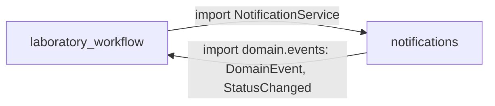
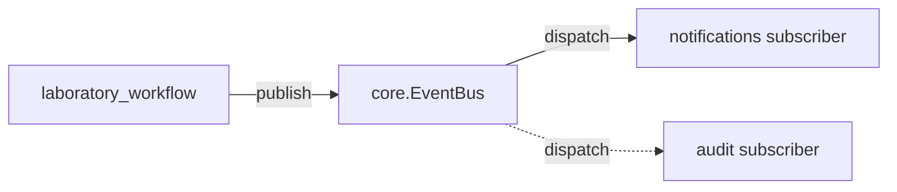
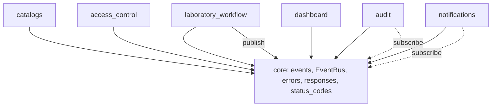

# Backend Architecture Review

Аудит фактической архитектуры backend и целевое состояние для **модульного монолита в стиле DDD**.

:::note
Установка проекта: монолит в стиле DDD, возможно **один bounded context**, никогда не микросервисы. Это меняет «правильный» ответ — см. раздел [Желаемое состояние](#желаемое-состояние).
:::

## Фактическая архитектура

```
src/
├── main.py / app_factory.py        ← сборка FastAPI
├── api/v1/router.py                ← верхнеуровневый роутер
├── core/                           ← shared kernel: errors, responses, pagination,
│                                      status_codes, security, database, crud_query
├── infrastructure/db/models/
│   └── entities.py  (1059 строк)   ← одна общая ORM-схема: 27 моделей всех доменов
└── contexts/                       ← 6 «bounded contexts»
    ├── laboratory_workflow/   (domain/application/infrastructure/presentation) — ядро
    ├── catalogs/              (domain пустой — чистый CRUD)
    ├── access_control/        (RBAC)
    ├── audit/                 (change_log)
    ├── notifications/         (alerts)
    └── dashboard/             (нет domain — только read-проекции)
```

Каждый контекст формально следует DIP-стеку `domain → application → infrastructure → presentation`, и это соблюдается: `domain/` не тянет FastAPI/SQLAlchemy (есть тест `test_domain_does_not_import_fastapi_or_sqlalchemy`). Но граница **между** контекстами протекает в двух местах, а слой данных общий на всех.

### Реальный граф зависимостей между контекстами



Это **двунаправленный цикл**:

| Откуда | Куда | Что импортируется |
| --- | --- | --- |
| `laboratory_workflow/application/commands.py:16` | notifications | `NotificationService` (конкретный класс чужого application-слоя) |
| `laboratory_workflow/presentation/router.py:54-55` | notifications | `NotificationService` + `SqlAlchemyNotificationRepository` (конкретная инфра) |
| `notifications/domain/contracts.py:7` | laboratory_workflow | `DomainEvent`, `StatusChanged` |
| `notifications/application/service.py:10` | laboratory_workflow | `DomainEvent` |

Базовый тип `DomainEvent` (кросс-сквозное понятие) физически живёт в домене `laboratory_workflow`, и от него вынужден зависеть домен `notifications`.

## Выводы

:::warning
Ранжировано по важности. Пункт 1 — единственный настоящий архитектурный дефект; остальное — компромиссы и недокрученные гарантии.
:::

1. **Цикл `laboratory_workflow ↔ notifications` + `DomainEvent` в чужом домене.**
   `notifications/domain` зависит от `laboratory_workflow/domain`, а `laboratory_workflow/application` напрямую держит экземпляр `NotificationService`. Связывает два «независимых» контекста жёстко и в обе стороны — изолированно ни вынести, ни тестировать нельзя.

2. **Общая ORM-модель `entities.py` (1059 строк, 27 моделей).**
   Все контексты читают/пишут один модуль и одну схему. Для модульного монолита это допустимый компромисс, но в нынешнем виде это файл-«бог»: `User`, `Direction`, `Notification`, `ChangeLog`, `Role` лежат вперемешку — границы модулей в данных не видны.

3. **Архитектурные тесты слабые и не ловят главное.**
   `tests/test_architecture_boundaries.py` проверяет только наличие `__init__.py`, что `core` не тянет contexts, и что domain без FastAPI/SQLAlchemy. Не проверяет: запрет межконтекстных импортов, направление слоёв, а в наборе `CONTEXTS` **нет `dashboard`** — то есть цикл из п.1 тесты пропускают.

4. **Непоследовательность слоёв.** `dashboard` без `domain/`, `catalogs/domain` пустой. Сейчас это «как получилось», а не осознанное решение «read-модель / CRUD без бизнес-правил».

5. **`presentation` импортирует конкретные репозитории инфраструктуры** (`router.py` → `SqlAlchemyNotificationRepository`). DI-проводка в роутере терпима, но связывает presentation с конкретикой инфры в обход портов.

6. **Крупные репозитории.** `laboratory_workflow/infrastructure/repositories.py` — 1112 строк, `crud_repositories.py` — 822. Кандидаты на разрезание по агрегатам.

## Желаемое состояние

То, что названо «6 bounded contexts», на самом деле — **6 модулей (подобластей) внутри ОДНОГО bounded context** «Лабораторный учёт». Признаки: одна БД-схема, один язык предметной области, общие статусы и `core`. Это не недостаток — это **модульный монолит**, и для цели проекта он правильнее, чем 6 изолированных контекстов с анти-коррупционными слоями.

Поэтому цель — **не** строить ACL и копии моделей между модулями, а навести три вещи.

### A. Общий kernel для кросс-сквозных понятий

`DomainEvent` / `StatusChanged` — это shared kernel, а не собственность `laboratory_workflow`. Вынести в `src/core/events.py`. Тогда `notifications/domain` зависит от ядра, а не от другого модуля — **обратное ребро цикла исчезает**.

### B. Внутренняя шина событий вместо прямого вызова

`laboratory_workflow` не должен знать про `NotificationService`. Он публикует событие в внутренний `EventBus` (порт в `core`), а `notifications` на него подписан. Прямой импорт уходит — **прямое ребро цикла исчезает**.



### C. Жёсткие, проверяемые границы модулей

Усилить `test_architecture_boundaries.py`, чтобы он реально запрещал:

- межмодульные импорты `contexts.X → contexts.Y` (единственное исключение — общий kernel);
- импорт `presentation`/`application` из чужого модуля;
- импорт конкретной инфры из presentation (только порты);
- включить `dashboard` в набор и явно описать его как read-модуль без `domain`.

### Целевая раскладка модели данных

Оставить **одну схему БД** (это монолит — джойны между модулями допустимы), но разрезать `entities.py` по модулям: `infrastructure/db/models/{laboratory,catalogs,access_control,audit,notifications}.py` с общим `Base`. Границы становятся видны в данных без дублирования.

### Целевой граф зависимостей



Ни одного прямого `import` между модулями — только вниз, в kernel, и обмен через шину.

## Шаги перехода

По возрастанию усилий, каждый самодостаточен:

1. **Вынести `DomainEvent`/`StatusChanged` в `core/events.py`.** Поправить импорты в `notifications`. Убирает обратное ребро цикла. *(~30 мин)*
2. **Ввести `EventBus`-порт в `core` + диспетчер.** `WorkflowCommandService` публикует в шину вместо хранения `NotificationService`; `notifications` регистрируется подписчиком в `app_factory`. Убирает прямое ребро цикла. *(полдня)*
3. **Усилить архитектурный тест** (запрет межмодульных импортов, dashboard в наборе, направление слоёв). Храповик, фиксирующий п.1–2. *(~1 ч)*
4. **Разрезать `entities.py`** по модулям с общим `Base`. Механически, без смены схемы/миграций. *(полдня)*
5. **Задокументировать** в `backend/CLAUDE.md`: это модульный монолит = один bounded context, модули общаются только через `core` + `EventBus`, общая схема БД — намеренно.
6. *(Опционально)* разрезать `laboratory_workflow`-репозитории по агрегатам (direction / sample / research / test / protocol).

:::tip
Самые ценные — **шаги 1–3**: они устраняют единственный настоящий архитектурный дефект (цикл) и закрепляют границы тестом, не требуя переписывания. Контракт API при этом не меняется — регенерация SDK во frontend не нужна.
:::
