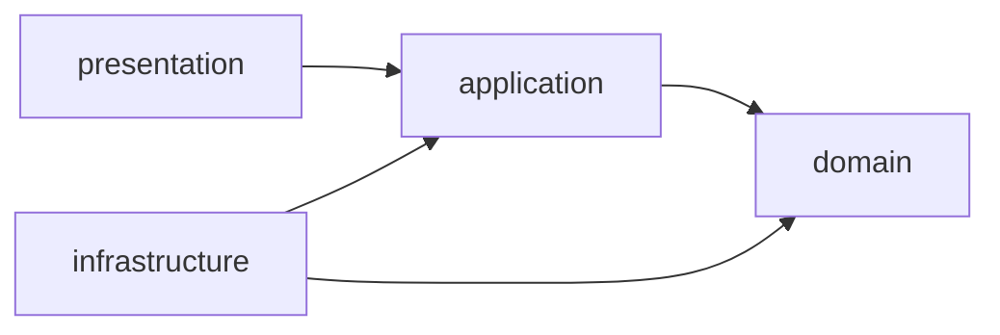

# Backend DDD Contexts

The backend is split into bounded contexts under `src/contexts`.

:::note
`src/core` contains shared framework primitives only. Business rules belong to context packages.
:::

## Contexts

| Context | Responsibility |
| --- | --- |
| `laboratory_workflow` | Direction, sample, research, test, and protocol lifecycle commands. |
| `catalogs` | Reference data and generic CRUD resource screens. |
| `access_control` | Role permission checks and backend scope filters. |
| `audit` | Immutable history entries exposed from the legacy `change_log` table. |
| `notifications` | Alert command surface and notification policy ports. |

## Boundaries

Domain code must stay independent from FastAPI, SQLAlchemy, and presentation schemas. Application services use DTOs and ports. Infrastructure implements persistence adapters. Presentation maps HTTP requests and response envelopes.
