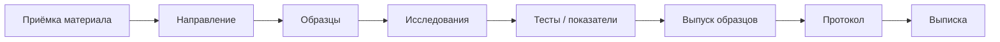

# Действия пользователей и карта автоматизации

Сквозная карта действий всех ролей — от приёмки материала до выдачи протокола — с пометкой,
что **автоматизирует старая программа** и что **потенциально автоматизируемо** новой системой.
Соответствует этапу **A2.1** роадмапа; источник приоритетов для продуктового блока C.

> Статус: **каркас** (A2.1). Диаграмму и карту заполнять по материалам владельца
> (NotebookLM) + [../product/work-processes-by-roles.md](../product/work-processes-by-roles.md)
> и [../product/role-access-matrix.md](../product/role-access-matrix.md).

## Легенда карты автоматизации

| Метка | Значение |
|---|---|
| 🟦 | Автоматизируется **старой программой** (легаси уже делает) |
| 🟩 | **Потенциально автоматизируемо** новой системой (кандидат на фичу) |
| ⬜ | Ручное, автоматизация нецелесообразна |

## Сквозной поток (каркас)

## Действия по ролям (каркас таблицы)

| Роль | Действие | Шаг потока | Метка | Примечание |
|---|---|---|---|---|
| Регистратор | Импорт направления | Приёмка | 🟦→🟩 | легаси импортирует; новая — пошаговый wizard (C1.1) |
| Регистратор | Ручное создание направления+образцы | Приёмка | 🟩 | пошаговый процесс (C1.2) |
| Врач-лаборант | Проставить показатели, комментарии | Тесты | 🟩 | → в протокол (C2) |
| Врач-лаборант | Выпустить образец | Выпуск | 🟩 | `analyzed→completed` (C2) |
| Начлаб | Правка после выпуска (аудит) | Выпуск+ | 🟩 | отметка в `change_log` (C3) |
| — | Формирование протокола из xlsx | Протокол | 🟦→🟩 | разобрать легаси (C4.1) |
| — | Выписка с бракованными | Выписка | 🟩 | по шаблону (C4.2) |
<!-- TODO A2.1: дополнить полный реестр действий всех 7 ролей -->
