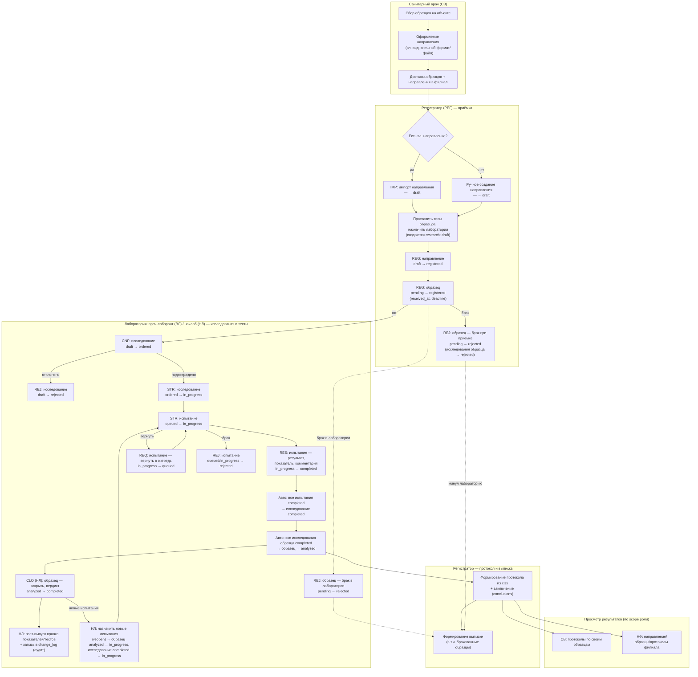

# Действия пользователей и карта автоматизации

Сквозная карта действий всех ролей — от приёмки материала до выдачи протокола — с пометкой,
что **автоматизирует старая программа** и что **потенциально автоматизируемо** новой системой.
Соответствует этапу **A2.1** роадмапа; источник приоритетов для продуктового блока C.

> Статус: **заполнено** (A2.1). Источники: [../product/work-processes-by-roles.md](../product/work-processes-by-roles.md),
> [../product/role-access-matrix.md](../product/role-access-matrix.md),
> [../product/frontend-user-stories.md](../product/frontend-user-stories.md),
> [../roles/README.md](../roles/README.md), корневой `CLAUDE.md`, `ROADMAP.md` (§A2.1, §Блок C).

## Легенда карты автоматизации

| Метка | Значение |
|---|---|
| 🟦 | Автоматизируется **старой программой** (легаси уже делает) |
| 🟩 | **Потенциально автоматизируемо** новой системой (кандидат на фичу) |
| ⬜ | Ручное, автоматизация нецелесообразна |

Составные метки (`🟦→🟩`) означают: легаси частично делает то же самое, новая система
переосмысливает процесс (например, пошаговый wizard вместо одной формы). Пометка
`(уточнить у владельца)` — нет однозначных данных о том, что именно делает легаси-программа.

## Сквозной поток по ролям

Диаграмма — дорожки (`subgraph`) по ролям/зонам ответственности, узлы — конкретные действия
со статусными переходами (коды команд — см. [role-access-matrix.md](../product/role-access-matrix.md)).
Ветвления: брак образца на приёмке (минует лабораторию и протокол, попадает сразу в выписку),
брак образца/испытания в лаборатории, reopen (НЛ назначает новые испытания после закрытия),
requeue испытания.

## Действия по ролям (полный реестр)

| Роль | Действие | Шаг потока | Метка | Примечание |
|---|---|---|---|---|
| Санитарный врач | Сбор образцов на объекте | Приёмка (до системы) | ⬜ | физический процесс вне системы |
| Санитарный врач | Оформление направления в электронном виде (внешний формат/файл) | Приёмка | 🟩 `(уточнить у владельца)` | не создаётся в системе; кандидат — электронная подача направления СВ, вне явных C1–C4 |
| Санитарный врач | Просмотр статусов своих направлений и образцов | Мониторинг | 🟦 `(уточнить у владельца)` | вероятно, легаси тоже давало справку по статусу |
| Санитарный врач | Просмотр протоколов по своим образцам | Протокол/Выписка (просмотр) | 🟦 `(уточнить у владельца)` | scope `own` по объектам |
| Санитарный врач | Уведомления: прочитать / скрыть (MRK/HID) | Сквозной | 🟩 | новая система уведомлений, кандидат вне C1–C4 |
| Регистратор | Импорт направления (IMP, `— → draft`) | Приёмка | 🟦→🟩 | легаси импортирует; новая — пошаговый wizard (C1.1) |
| Регистратор | Ручное создание направления (`— → draft`) | Приёмка | 🟩 | пошаговый процесс, переиспользует wizard C1.1 (C1.2) |
| Регистратор | Проставить типы образцов по каждому образцу | Приёмка/Направление | 🟩 | шаг wizard, образец-за-образцом (C1.1/C1.2) |
| Регистратор | Назначить лаборатории (создаются исследования `draft`) | Направление | 🟩 | шаг wizard (C1.1/C1.2) |
| Регистратор | Зарегистрировать направление (`draft → registered`) | Направление | 🟦→🟩 | легаси регистрирует; довести до пошагового потока (C1.1/C1.2) |
| Регистратор | Зарегистрировать образец (`pending → registered`, `received_at`) | Образцы | 🟦→🟩 | легаси регистрирует; довести до пошагового UI (C1.1/C1.2) |
| Регистратор | Брак при приёмке (`pending → rejected`, REJ) | Образцы | 🟩 | с подсветкой невалидных полей (C1.5) |
| Регистратор | Отклонить исследование (`draft → rejected`, REJ) | Исследования | 🟩 | часть правки при браке образца (C1.1/C1.5) |
| Регистратор | Массовая регистрация направлений/образцов с детальными ошибками по записи | Приёмка | 🟩 | адресные ошибки + переход к правке с подсветкой (C1.5) |
| Регистратор | Фильтрация по направлениям/образцам | Мониторинг | 🟩 | доведение существующей фильтрации, покрытие e2e (C1.3) |
| Регистратор | Окно «выпущенные образцы по направлениям» (группировка, жёлтая подсветка) | Пост-выпуск (просмотр) | 🟩 | read-проекция «выпущено/всего» (C1.4) |
| Регистратор | Ведение справочника объектов (в рамках филиала, C/R/U) | Справочники | 🟦 `(уточнить у владельца)` | возможно, есть в легаси как справочник контрагентов |
| Регистратор | Формирование протокола из xlsx | Протокол | 🟦→🟩 | легаси формирует по xlsx-шаблону; разобрать алгоритм и реализовать (C4.1) |
| Регистратор | Создание/редактирование заключений (`conclusions`) | Протокол | 🟦→🟩 | легаси — шаблонные выводы; новая — конструктор заключения (C4.1) |
| Регистратор | Формирование выписки (в т.ч. бракованные образцы) | Выписка | 🟦→🟩 | легаси формирует; новая — по шаблону, отдельный документ/эндпоинт (C4.2) |
| Регистратор | Просмотр исследований и испытаний (только чтение) | Мониторинг | 🟦 `(уточнить у владельца)` | read-only, без изменения статусов |
| Регистратор | Уведомления: прочитать / скрыть (MRK/HID) | Сквозной | 🟩 | новая система уведомлений |
| Врач-лаборант | Просмотр очереди исследований своей лаборатории (`draft`) | Исследования | 🟦 `(уточнить у владельца)` | рабочая очередь, критична для скорости работы ВЛ (C2) |
| Врач-лаборант | Подтвердить исследование (CNF, `draft → ordered`) | Исследования | 🟩 | вертикальный слайс ВЛ (C2) |
| Врач-лаборант | Отклонить исследование (REJ, `draft → rejected`) | Исследования | 🟩 | вертикальный слайс ВЛ (C2) |
| Врач-лаборант | Взять исследование в работу (STR, `ordered → in_progress`) | Исследования | 🟩 | вертикальный слайс ВЛ (C2) |
| Врач-лаборант | Взять испытание в работу (STR, `queued → in_progress`) | Тесты | 🟩 | вертикальный слайс ВЛ (C2) |
| Врач-лаборант | Внести результат испытания — показатель (RES, `in_progress → completed`) | Тесты | 🟩 | попадает в протокол (C2) |
| Врач-лаборант | Комментарий к образцу (для протокола) | Тесты | 🟩 | попадает в проекцию протокола (C2) |
| Врач-лаборант | Вернуть испытание в очередь (REQ, `in_progress → queued`) | Тесты | 🟩 | вертикальный слайс ВЛ (C2) |
| Врач-лаборант | Отклонить испытание (REJ, `queued`/`in_progress → rejected`) | Тесты | 🟩 | вертикальный слайс ВЛ (C2) |
| Врач-лаборант | Отклонить образец — брак (REJ, `pending → rejected`) | Образцы | 🟩 | обязательная причина (C2) |
| Врач-лаборант | Выпустить образец (CLO, `analyzed → completed`) | Выпуск | 🟩 `(противоречие источников — уточнить у владельца)` | ROADMAP §C2/US §4 относят команду `close` к ВЛ; `role-access-matrix.md`/`work-processes-by-roles.md` закрепляют CLO только за НЛ |
| Врач-лаборант | Уведомления: прочитать / скрыть (MRK/HID) | Сквозной | 🟩 | новая система уведомлений |
| Ассистент лаборатории | Просмотр направлений/образцов/исследований/испытаний своей лаборатории | Мониторинг | ⬜ | только чтение, изменения недоступны |
| Ассистент лаборатории | Просмотр справочников (типы образцов, цели исследований, показатели) | Справочники (просмотр) | ⬜ | только чтение |
| Ассистент лаборатории | Информирование ВЛ/НЛ о проблемных позициях | — | ⬜ | вне системы (устно/иным каналом), уведомлений роль не получает |
| Начальник лаборатории | Все действия врача-лаборанта в своей лаборатории (CNF/STR/RES/REQ/REJ) | Исследования/Тесты | 🟩 | замещает ВЛ, переиспользует C2 |
| Начальник лаборатории | Закрыть образец, установить вердикт (CLO, `analyzed → completed`) | Выпуск | 🟩 | закреплено за НЛ по role-access-matrix (C2/C3) |
| Начальник лаборатории | Назначить новые испытания после закрытия (reopen: `analyzed → in_progress`, исследование `completed → in_progress`) | Пост-выпуск | 🟩 | новая команда (C3) |
| Начальник лаборатории | Пост-выпуск правка показателей/тестов с обязательной отметкой в аудите (`change_log`) | Пост-выпуск | 🟩 | новая команда + запись актора/до/после (C3) |
| Начальник лаборатории | Управление показателями (`indicators`, C/R/U/D) в рамках своей лаборатории | Справочники | 🟩 | scope `own_lab` — на FE до D5, сервер — D5 (C3) |
| Начальник лаборатории | Управление целями исследований (`research_goals`, C/R/U/D) в рамках своей лаборатории | Справочники | 🟩 | scope `own_lab` — на FE до D5, сервер — D5 (C3) |
| Начальник лаборатории | Просмотр всех образцов/исследований/протоколов своей лаборатории | Мониторинг | 🟦 `(уточнить у владельца)` | read-only |
| Начальник лаборатории | Уведомления: прочитать / скрыть (MRK/HID) | Сквозной | 🟩 | новая система уведомлений |
| Начальник филиала | Просмотр направлений/образцов/протоколов в рамках филиала | Мониторинг | 🟦 `(уточнить у владельца)` | read-only по всем лабораториям филиала |
| Начальник филиала | Дашборд филиала (сводная статистика, 4 KPI + график) | Мониторинг | 🟩 | новая агрегированная аналитика, вне явных C1–C4 |
| Начальник филиала | Уведомления о критических событиях (брак, просроченный дедлайн, вердикт «не соответствует») | Сквозной | 🟩 | новая система уведомлений |
| Начальник филиала | Уведомления: прочитать / скрыть (MRK/HID) | Сквозной | 🟩 | новая система уведомлений |
| Администратор пользователей | Создание пользователя (C) | Управление доступом | 🟩 | фундамент RBAC (B1), легаси такой ролевой модели, вероятно, не имел |
| Администратор пользователей | Редактирование/блокировка/удаление пользователя (U/D) | Управление доступом | 🟩 | B1 |
| Администратор пользователей | Назначение роли пользователю | Управление доступом | 🟩 | B1 |
| Администратор пользователей | Настройка области видимости (`user_scopes`: филиал/лаборатория) | Управление доступом | 🟩 | B1; серверный энфорсмент — D5 |
| Администратор пользователей | Управление ролями и разрешениями (`roles`, `permissions`, `role_permissions`, C/R/U/D) | Управление доступом | 🟩 | B1 |
| Администратор пользователей | Просмотр пользователей без настроенной области видимости (отчёт) | Управление доступом (просмотр) | 🟩 | быстрое действие главного экрана АП |
</content>
