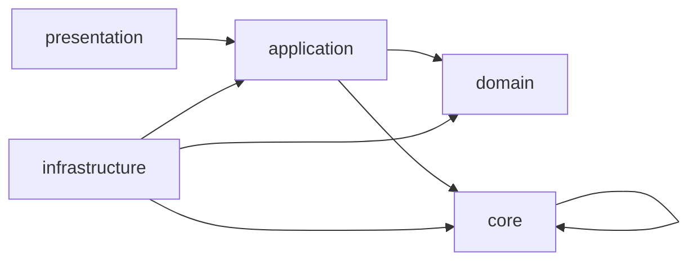
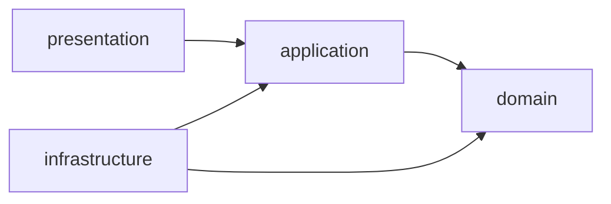

# Backend MVP DDD API Implementation Plan

> **For agentic workers:** REQUIRED SUB-SKILL: Use superpowers:subagent-driven-development (recommended) or superpowers:executing-plans to implement this plan task-by-task. Steps use checkbox (`- [ ]`) syntax for tracking.

**Goal:** Build the backend MVP from `docs/superpowers/specs/2026-05-14-backend-mvp-ddd-api-design.md` on top of the current repository by introducing DDD bounded contexts under `src/contexts`, shared backend primitives under `src/core`, and `/api/v1` CRUD plus command endpoints.

**Architecture:** Keep `src/core` for cross-context primitives only: configuration, DB session, errors, response envelopes, pagination, auth dependencies, unit-of-work protocol, and request metadata. Put business code in context modules: `domain` owns invariants and status transitions, `application` owns use cases and DTOs, `infrastructure` owns SQLAlchemy repositories and adapters, and `presentation` owns FastAPI routers/schemas. Existing SQLAlchemy models remain the persistence model first, then can be split per context without changing table names.

**Tech Stack:** Python 3.11, FastAPI, Pydantic v2 via FastAPI, SQLAlchemy 2 async, Alembic, PostgreSQL, pytest, pytest-asyncio, httpx, ruff, mypy strict.

---

## Execution Checkpoint

Last updated: 2026-05-15.

Completed and committed:

- [x] Task 1: Repair Boot Imports And Add `/api/v1` Router Shell.
  - Commit: `53b1696 chore: add api router shell`
  - Notes: added `pyproject.toml` `pythonpath = "."` so tests can import `src.*`; boot test clears cached settings.
- [x] Task 2: Create Context Packages And Architecture Boundary Test.
  - Commit: `e52b2f8 chore: add ddd context packages`
- [x] Task 3: Add Shared Core API Contracts.
  - Commit: `3b277ca feat: add shared api contracts`
  - Fix commit: `860d888 fix: align shared api contracts`
- [x] Task 4: Add Database Migration For MVP Clarifications.
  - Commit: `880c89a feat: add mvp workflow persistence fields`
  - Fix commit: `1b069fa fix: index research lab scope field`
  - Notes: `Research.lab_id` is nullable in model and migration until a later backfill; `samples.protocol_id` and `protocols.issued_at` already existed and were not duplicated.
- [x] Task 5: Implement Laboratory Workflow Domain Status Policies.
  - Commit: `21768a1 feat: add workflow status policies`
- [x] Task 6: Add Application DTOs And Repository Protocols.
  - Commit: `6b1cb02 feat: add workflow application ports`
  - Fix included in: `e5dba4e feat: add workflow command endpoint shell`
  - Notes: tightened application timestamp DTOs to timezone-aware datetimes.
- [x] Task 7: Implement First Workflow Command End-To-End.
  - Commit: `e5dba4e feat: add workflow command endpoint shell`
  - Notes: added command service, FastAPI endpoint shell, dependency override tests, and explicit repository placeholder errors.
- [x] Task 8: Implement Generic CRUD Foundation For Resource Screens.
  - Commit: `ebdc60d feat: add catalog crud foundation`
  - Notes: added CRUD registry and `/api/v1/branches` placeholder route returning explicit repository-not-wired conflict.
- [x] Task 9: Wire Access Control Context For Permission And Scope Checks.
  - Commit: `28041c0 feat: add access control policy shell`
  - Notes: added MVP role permission map, permission checker port, actor header dependency, and policy tests.

Resume from:

1. Continue with Task 10: Implement Workflow Commands In Persistence.
2. Keep unrelated legacy tracked deletions untouched unless explicitly requested.

Known workspace state:

- The worktree contains many pre-existing tracked deletions from legacy `scripts/`, `src/api/v1/endpoints/`, `src/models/`, `src/repositories/`, `src/schemas/`, `src/services/`, and legacy `tests/`. Do not revert or stage them unless explicitly requested.
- Full `ruff check src tests migrations` still has unrelated migration line-length failures.
- Full `mypy --strict src` still has unrelated existing errors in `src/core/config.py` and `src/core/security.py`.
- `uv run alembic upgrade head` was not validated because required `APP_*` settings and a database environment were not configured.

## Current Repository Starting Point

The current repository is a thin FastAPI shell:

- `src/app_factory.py` includes `src.api.v1.router`, but `src/api/v1/router.py` does not exist yet.
- `src/core` already contains config, DB session factory, security, errors, and problem-details handlers.
- `src/infrastructure/db/models/entities.py` contains the SQLAlchemy persistence model in one file, but imports `Base` from `src.models.base`, while the real file is `src/infrastructure/db/models/base.py`.
- `src/infrastructure/db/models/__init__.py`, `migrations/env.py`, and `migrations/versions/20260218_0001_initial_schema.py` also reference `src.models`, which is not present.
- `tests/` exists but has no tests.
- `.codex/skills/*` project skills listed in `AGENTS.md` are not present in the current checkout, so implementation should follow the repository instructions directly.

## Target Structure

Create this structure and keep package imports absolute from `src`:

```text
src/
  api/
    __init__.py
    v1/
      __init__.py
      router.py
  contexts/
    __init__.py
    access_control/
      __init__.py
      application/
      domain/
      infrastructure/
      presentation/
    audit/
      __init__.py
      application/
      domain/
      infrastructure/
      presentation/
    catalogs/
      __init__.py
      application/
      domain/
      infrastructure/
      presentation/
    laboratory_workflow/
      __init__.py
      application/
      domain/
      infrastructure/
      presentation/
    notifications/
      __init__.py
      application/
      domain/
      infrastructure/
      presentation/
  core/
    config.py
    database.py
    errors.py
    handlers.py
    pagination.py
    responses.py
    security.py
    status_codes.py
    unit_of_work.py
  infrastructure/
    db/
      models/
        base.py
        entities.py
        __init__.py
```

Dependency direction:



Rules:

- `domain` must not import FastAPI, SQLAlchemy, or Pydantic schemas from `presentation`.
- `application` may use Pydantic DTOs only for application input/output models; it must not depend on FastAPI routers.
- `presentation` maps HTTP requests to application use cases and response envelopes.
- `infrastructure` maps SQLAlchemy persistence models to domain/application outputs.
- `core` must not import any context package.

## Implementation Tasks

### Task 1: Repair Boot Imports And Add `/api/v1` Router Shell

**Files:**

- Create: `src/api/__init__.py`
- Create: `src/api/v1/__init__.py`
- Create: `src/api/v1/router.py`
- Modify: `src/infrastructure/db/models/entities.py`
- Modify: `src/infrastructure/db/models/__init__.py`
- Modify: `migrations/env.py`
- Modify: `migrations/versions/20260218_0001_initial_schema.py`
- Test: `tests/test_app_boot.py`

- [ ] **Step 1: Write the failing boot test**

Create `tests/test_app_boot.py`:

```python
from fastapi.testclient import TestClient

from src.app_factory import create_app


def test_app_boots_and_health_endpoint_returns_ok() -> None:
    app = create_app()
    client = TestClient(app)

    response = client.get("/api/v1/health")

    assert response.status_code == 200
    assert response.json() == {"status": "ok"}
```

- [ ] **Step 2: Run the test and verify current failure**

Run:

```bash
uv run pytest tests/test_app_boot.py -v
```

Expected: FAIL during import with `ModuleNotFoundError: No module named 'src.api'` or `No module named 'src.models'`.

- [ ] **Step 3: Create the router shell**

Create `src/api/__init__.py`:

```python
"""API package."""
```

Create `src/api/v1/__init__.py`:

```python
"""Version 1 API package."""
```

Create `src/api/v1/router.py`:

```python
from fastapi import APIRouter

router = APIRouter()


@router.get("/health", tags=["system"])
async def health() -> dict[str, str]:
    return {"status": "ok"}
```

- [ ] **Step 4: Repair model imports**

In `src/infrastructure/db/models/entities.py`, replace:

```python
from src.models.base import Base
```

with:

```python
from src.infrastructure.db.models.base import Base
```

In `src/infrastructure/db/models/__init__.py`, replace:

```python
from src.models.base import Base
from src.models.entities import (
```

with:

```python
from src.infrastructure.db.models.base import Base
from src.infrastructure.db.models.entities import (
```

In `migrations/env.py` and `migrations/versions/20260218_0001_initial_schema.py`, replace:

```python
from src.models import Base
```

with:

```python
from src.infrastructure.db.models import Base
```

- [ ] **Step 5: Run the boot test and quality checks**

Run:

```bash
uv run pytest tests/test_app_boot.py -v
uv run ruff check src tests migrations
uv run mypy --strict src
```

Expected: boot test PASS. Fix import sorting and type errors before continuing.

- [ ] **Step 6: Commit**

```bash
git add src/api src/infrastructure/db/models migrations tests/test_app_boot.py
git commit -m "chore: add api router shell"
```

### Task 2: Create Context Packages And Architecture Boundary Test

**Files:**

- Create: all `src/contexts/**/__init__.py`
- Create: `tests/test_architecture_boundaries.py`

- [ ] **Step 1: Write the failing architecture test**

Create `tests/test_architecture_boundaries.py`:

```python
from pathlib import Path


CONTEXTS = {
    "access_control",
    "audit",
    "catalogs",
    "laboratory_workflow",
    "notifications",
}
LAYERS = {"domain", "application", "infrastructure", "presentation"}


def test_context_layer_packages_exist() -> None:
    root = Path("src/contexts")

    for context in CONTEXTS:
        context_path = root / context
        assert (context_path / "__init__.py").is_file()
        for layer in LAYERS:
            assert (context_path / layer / "__init__.py").is_file()


def test_core_does_not_import_contexts() -> None:
    for path in Path("src/core").glob("*.py"):
        source = path.read_text(encoding="utf-8")
        assert "src.contexts" not in source, path


def test_domain_does_not_import_fastapi_or_sqlalchemy() -> None:
    for path in Path("src/contexts").glob("*/domain/**/*.py"):
        source = path.read_text(encoding="utf-8")
        assert "fastapi" not in source.lower(), path
        assert "sqlalchemy" not in source.lower(), path
```

- [ ] **Step 2: Run the test and verify it fails**

Run:

```bash
uv run pytest tests/test_architecture_boundaries.py -v
```

Expected: FAIL because `src/contexts` does not exist.

- [ ] **Step 3: Create context layer packages**

Create each `__init__.py` with a one-line docstring:

```python
"""Bounded context package."""
```

Use context-specific text for top-level context packages:

```python
"""Laboratory workflow bounded context."""
```

Layer package files can use:

```python
"""Layer package."""
```

- [ ] **Step 4: Run the architecture test**

Run:

```bash
uv run pytest tests/test_architecture_boundaries.py -v
```

Expected: PASS.

- [ ] **Step 5: Commit**

```bash
git add src/contexts tests/test_architecture_boundaries.py
git commit -m "chore: add ddd context packages"
```

### Task 3: Add Shared Core API Contracts

**Files:**

- Create: `src/core/pagination.py`
- Create: `src/core/responses.py`
- Create: `src/core/status_codes.py`
- Create: `src/core/unit_of_work.py`
- Modify: `src/core/errors.py`
- Modify: `src/core/handlers.py`
- Test: `tests/core/test_responses.py`
- Test: `tests/core/test_errors.py`

- [ ] **Step 1: Write response envelope tests**

Create `tests/core/test_responses.py`:

```python
from uuid import UUID

from src.core.pagination import PageMeta, PaginationParams
from src.core.responses import ListResponse, ResponseMeta, SingleResponse


def test_pagination_params_defaults_and_limit_cap() -> None:
    params = PaginationParams()

    assert params.offset == 0
    assert params.limit == 50

    capped = PaginationParams(limit=500)
    assert capped.limit == 100


def test_single_response_uses_snake_case_meta() -> None:
    response = SingleResponse[dict[str, str]](
        data={"id": "abc"},
        meta=ResponseMeta(request_id=UUID("00000000-0000-0000-0000-000000000001")),
    )

    payload = response.model_dump(mode="json")

    assert payload["data"] == {"id": "abc"}
    assert payload["meta"]["version"] == "v1"
    assert payload["meta"]["request_id"] == "00000000-0000-0000-0000-000000000001"


def test_list_response_meta_contains_include_fields() -> None:
    response = ListResponse[dict[str, str]](
        items=[{"id": "abc"}],
        meta=PageMeta(
            total=1,
            offset=0,
            limit=50,
            has_more=False,
            includes_requested=["status"],
            includes_applied=["status"],
            includes_allowed=["status", "lab"],
        ),
    )

    payload = response.model_dump(mode="json")

    assert payload["items"] == [{"id": "abc"}]
    assert payload["meta"]["includes_requested"] == ["status"]
    assert payload["meta"]["includes_allowed"] == ["status", "lab"]
```

- [ ] **Step 2: Write error contract tests**

Create `tests/core/test_errors.py`:

```python
from fastapi import FastAPI
from fastapi.testclient import TestClient

from src.core.errors import DomainConflictError
from src.core.handlers import app_error_handler


def test_domain_conflict_error_uses_problem_details_shape() -> None:
    app = FastAPI()
    app.add_exception_handler(DomainConflictError, app_error_handler)

    @app.get("/boom")
    async def boom() -> None:
        raise DomainConflictError(
            code="invalid_status_transition",
            detail="Sample can be closed only from analyzed status.",
        )

    response = TestClient(app).get("/boom")

    assert response.status_code == 409
    assert response.headers["content-type"].startswith("application/problem+json")
    assert response.json() == {
        "type": "https://api.example.com/errors/invalid-status-transition",
        "title": "Conflict",
        "status": 409,
        "detail": "Sample can be closed only from analyzed status.",
        "instance": "/boom",
        "errors": [],
        "code": "invalid_status_transition",
    }
```

- [ ] **Step 3: Implement pagination and response models**

Create `src/core/pagination.py`:

```python
from typing import Literal

from pydantic import BaseModel, Field, field_validator


SortOrder = Literal["asc", "desc"]


class PaginationParams(BaseModel):
    offset: int = Field(default=0, ge=0)
    limit: int = Field(default=50, ge=1)
    sort_by: str | None = None
    sort_order: SortOrder = "asc"
    filters: str | None = None
    include: str | None = None

    @field_validator("limit")
    @classmethod
    def cap_limit(cls, value: int) -> int:
        return min(value, 100)

    @property
    def includes_requested(self) -> list[str]:
        if not self.include:
            return []
        return [item.strip() for item in self.include.split(",") if item.strip()]


class PageMeta(BaseModel):
    timestamp: str | None = None
    request_id: str | None = None
    version: str = "v1"
    total: int
    offset: int
    limit: int
    next_cursor: str | None = None
    has_more: bool
    includes_requested: list[str] = Field(default_factory=list)
    includes_applied: list[str] = Field(default_factory=list)
    includes_allowed: list[str] = Field(default_factory=list)
```

Create `src/core/responses.py`:

```python
from datetime import UTC, datetime
from typing import Generic, TypeVar
from uuid import UUID

from pydantic import BaseModel, Field, field_serializer

from src.core.pagination import PageMeta

T = TypeVar("T")


def utc_now_iso() -> str:
    return datetime.now(UTC).isoformat().replace("+00:00", "Z")


class ResponseMeta(BaseModel):
    timestamp: str = Field(default_factory=utc_now_iso)
    request_id: UUID | None = None
    version: str = "v1"
    includes: list[str] = Field(default_factory=list)
    includes_requested: list[str] = Field(default_factory=list)
    includes_applied: list[str] = Field(default_factory=list)
    includes_allowed: list[str] = Field(default_factory=list)
    operation: str | None = None

    @field_serializer("request_id")
    def serialize_request_id(self, value: UUID | None) -> str | None:
        return str(value) if value else None


class SingleResponse(BaseModel, Generic[T]):
    data: T
    meta: ResponseMeta


class ListResponse(BaseModel, Generic[T]):
    items: list[T]
    meta: PageMeta
```

Create `src/core/status_codes.py`:

```python
DIRECTION_DRAFT = "draft"
DIRECTION_REGISTERED = "registered"
DIRECTION_IN_PROGRESS = "in_progress"
DIRECTION_PARTIALLY_COMPLETED = "partially_completed"
DIRECTION_COMPLETED = "completed"

SAMPLE_PENDING = "pending"
SAMPLE_REGISTERED = "registered"
SAMPLE_IN_PROGRESS = "in_progress"
SAMPLE_ANALYZED = "analyzed"
SAMPLE_COMPLETED = "completed"
SAMPLE_REJECTED = "rejected"

RESEARCH_DRAFT = "draft"
RESEARCH_ORDERED = "ordered"
RESEARCH_IN_PROGRESS = "in_progress"
RESEARCH_COMPLETED = "completed"
RESEARCH_REJECTED = "rejected"

TEST_QUEUED = "queued"
TEST_IN_PROGRESS = "in_progress"
TEST_COMPLETED = "completed"
TEST_REJECTED = "rejected"
```

Create `src/core/unit_of_work.py`:

```python
from typing import Protocol


class UnitOfWork(Protocol):
    async def commit(self) -> None: ...

    async def rollback(self) -> None: ...
```

- [ ] **Step 4: Add conflict/domain error classes**

In `src/core/errors.py`, keep existing classes and add:

```python
class DomainConflictError(AppError):
    def __init__(self, *, code: str, detail: str) -> None:
        super().__init__(
            status_code=409,
            title="Conflict",
            detail=detail,
            type_uri=f"https://api.example.com/errors/{code.replace('_', '-')}",
            extra={"errors": [], "code": code},
        )
```

Update existing `ValidationError` to include `errors` when omitted:

```python
extra={"errors": [], **dict(extra or {})},
```

- [ ] **Step 5: Run tests**

Run:

```bash
uv run pytest tests/core/test_responses.py tests/core/test_errors.py -v
uv run ruff check src tests
uv run mypy --strict src
```

Expected: PASS.

- [ ] **Step 6: Commit**

```bash
git add src/core tests/core
git commit -m "feat: add shared api contracts"
```

### Task 4: Add Database Migration For MVP Clarifications

**Files:**

- Modify: `src/infrastructure/db/models/entities.py`
- Create: `migrations/versions/20260514_0010_mvp_workflow_fields.py`
- Test: `tests/infrastructure/test_model_metadata.py`

- [ ] **Step 1: Write metadata test**

Create `tests/infrastructure/test_model_metadata.py`:

```python
from src.infrastructure.db.models import Direction, Protocol, Research, Sample


def test_mvp_workflow_fields_exist_on_models() -> None:
    assert "import_warnings" in Direction.__table__.columns
    assert "deadline" in Sample.__table__.columns
    assert "verdict" in Sample.__table__.columns
    assert "protocol_id" in Sample.__table__.columns
    assert "lab_id" in Research.__table__.columns
    assert "issued_at" in Protocol.__table__.columns
```

- [ ] **Step 2: Run test and identify missing fields**

Run:

```bash
uv run pytest tests/infrastructure/test_model_metadata.py -v
```

Expected: FAIL for any field absent from current models. If all pass, still create a no-op migration only if the database migration history already contains these fields.

- [ ] **Step 3: Update SQLAlchemy model fields**

In `Direction`, ensure this field exists:

```python
import_warnings: Mapped[dict[str, object] | None] = mapped_column(JSONB)
```

In `Sample`, ensure these fields exist:

```python
deadline: Mapped[datetime | None] = mapped_column(DateTime(timezone=True))
verdict: Mapped[str | None] = mapped_column(Text)
protocol_id: Mapped[UUID | None] = mapped_column(
    PGUUID(as_uuid=True),
    ForeignKey("protocols.id", name="fk_samples_protocol_id_protocols_id"),
)
```

In `Research`, ensure this field is non-null in the target schema:

```python
lab_id: Mapped[UUID] = mapped_column(
    PGUUID(as_uuid=True),
    ForeignKey("labs.id", name="fk_research_lab_id_labs_id"),
    nullable=False,
)
```

- [ ] **Step 4: Add Alembic migration**

Create `migrations/versions/20260514_0010_mvp_workflow_fields.py`:

```python
"""add mvp workflow fields

Revision ID: 20260514_0010
Revises: 20260303_0009
Create Date: 2026-05-14 00:10:00.000000
"""

from collections.abc import Sequence

import sqlalchemy as sa
from alembic import op
from sqlalchemy.dialects import postgresql

revision: str = "20260514_0010"
down_revision: str | None = "20260303_0009"
branch_labels: str | Sequence[str] | None = None
depends_on: str | Sequence[str] | None = None


def upgrade() -> None:
    op.add_column(
        "directions",
        sa.Column("import_warnings", postgresql.JSONB(astext_type=sa.Text()), nullable=True),
    )
    op.add_column("samples", sa.Column("deadline", sa.DateTime(timezone=True), nullable=True))
    op.add_column("samples", sa.Column("verdict", sa.Text(), nullable=True))
    op.add_column("samples", sa.Column("protocol_id", postgresql.UUID(as_uuid=True), nullable=True))
    op.create_foreign_key(
        "fk_samples_protocol_id_protocols_id",
        "samples",
        "protocols",
        ["protocol_id"],
        ["id"],
    )
    op.add_column("research", sa.Column("lab_id", postgresql.UUID(as_uuid=True), nullable=True))
    op.create_foreign_key("fk_research_lab_id_labs_id", "research", "labs", ["lab_id"], ["id"])


def downgrade() -> None:
    op.drop_constraint("fk_research_lab_id_labs_id", "research", type_="foreignkey")
    op.drop_column("research", "lab_id")
    op.drop_constraint("fk_samples_protocol_id_protocols_id", "samples", type_="foreignkey")
    op.drop_column("samples", "protocol_id")
    op.drop_column("samples", "verdict")
    op.drop_column("samples", "deadline")
    op.drop_column("directions", "import_warnings")
```

After backfilling `research.lab_id` from `research_goals.lab_id`, add a later migration to make it `nullable=False`. Do not force `NOT NULL` in this migration unless existing data has been backfilled.

- [ ] **Step 5: Run model and migration checks**

Run:

```bash
uv run pytest tests/infrastructure/test_model_metadata.py -v
uv run alembic upgrade head
uv run ruff check src migrations tests
uv run mypy --strict src
```

Expected: PASS. If no test database URL is configured, record that Alembic could not be executed locally.

- [ ] **Step 6: Commit**

```bash
git add src/infrastructure/db/models migrations/versions/20260514_0010_mvp_workflow_fields.py tests/infrastructure
git commit -m "feat: add mvp workflow persistence fields"
```

### Task 5: Implement Laboratory Workflow Domain Status Policies

**Files:**

- Create: `src/contexts/laboratory_workflow/domain/status_policy.py`
- Create: `src/contexts/laboratory_workflow/domain/events.py`
- Create: `tests/contexts/laboratory_workflow/domain/test_status_policy.py`

- [ ] **Step 1: Write status policy tests**

Create `tests/contexts/laboratory_workflow/domain/test_status_policy.py`:

```python
import pytest

from src.contexts.laboratory_workflow.domain.status_policy import (
    InvalidStatusTransition,
    ensure_allowed_transition,
)


def test_direction_register_transition_is_allowed() -> None:
    ensure_allowed_transition("directions", "draft", "registered")


def test_direction_patch_status_transition_is_not_allowed() -> None:
    with pytest.raises(InvalidStatusTransition) as exc:
        ensure_allowed_transition("directions", "draft", "completed")

    assert exc.value.code == "invalid_status_transition"


@pytest.mark.parametrize(
    ("resource", "from_code", "to_code"),
    [
        ("samples", "pending", "registered"),
        ("samples", "pending", "rejected"),
        ("samples", "analyzed", "completed"),
        ("research", "draft", "ordered"),
        ("research", "ordered", "in_progress"),
        ("research", "in_progress", "completed"),
        ("tests", "queued", "in_progress"),
        ("tests", "in_progress", "completed"),
        ("tests", "in_progress", "queued"),
    ],
)
def test_allowed_mvp_transitions(resource: str, from_code: str, to_code: str) -> None:
    ensure_allowed_transition(resource, from_code, to_code)
```

- [ ] **Step 2: Run test and verify failure**

Run:

```bash
uv run pytest tests/contexts/laboratory_workflow/domain/test_status_policy.py -v
```

Expected: FAIL because the domain module does not exist.

- [ ] **Step 3: Implement status policy**

Create `src/contexts/laboratory_workflow/domain/status_policy.py`:

```python
from dataclasses import dataclass


@dataclass(frozen=True)
class InvalidStatusTransition(Exception):
    resource: str
    from_code: str
    to_code: str
    code: str = "invalid_status_transition"


ALLOWED_TRANSITIONS: dict[str, set[tuple[str, str]]] = {
    "directions": {
        ("draft", "registered"),
        ("registered", "in_progress"),
        ("in_progress", "partially_completed"),
        ("in_progress", "completed"),
        ("partially_completed", "in_progress"),
        ("partially_completed", "completed"),
    },
    "samples": {
        ("pending", "registered"),
        ("pending", "rejected"),
        ("registered", "in_progress"),
        ("in_progress", "analyzed"),
        ("analyzed", "in_progress"),
        ("analyzed", "completed"),
    },
    "research": {
        ("draft", "ordered"),
        ("draft", "rejected"),
        ("ordered", "in_progress"),
        ("ordered", "rejected"),
        ("in_progress", "completed"),
        ("completed", "in_progress"),
    },
    "tests": {
        ("queued", "in_progress"),
        ("queued", "rejected"),
        ("in_progress", "completed"),
        ("in_progress", "queued"),
        ("in_progress", "rejected"),
    },
}


def ensure_allowed_transition(resource: str, from_code: str, to_code: str) -> None:
    if (from_code, to_code) not in ALLOWED_TRANSITIONS.get(resource, set()):
        raise InvalidStatusTransition(resource=resource, from_code=from_code, to_code=to_code)
```

Create `src/contexts/laboratory_workflow/domain/events.py`:

```python
from dataclasses import dataclass
from uuid import UUID


@dataclass(frozen=True)
class DomainEvent:
    entity_type: str
    entity_id: UUID
    event_type: str


@dataclass(frozen=True)
class StatusChanged(DomainEvent):
    from_code: str
    to_code: str
    reason: str
```

- [ ] **Step 4: Run tests**

Run:

```bash
uv run pytest tests/contexts/laboratory_workflow/domain/test_status_policy.py -v
uv run ruff check src tests
uv run mypy --strict src
```

Expected: PASS.

- [ ] **Step 5: Commit**

```bash
git add src/contexts/laboratory_workflow/domain tests/contexts/laboratory_workflow/domain
git commit -m "feat: add workflow status policies"
```

### Task 6: Add Application DTOs And Repository Protocols

**Files:**

- Create: `src/contexts/laboratory_workflow/application/dto.py`
- Create: `src/contexts/laboratory_workflow/application/ports.py`
- Create: `src/contexts/audit/application/ports.py`
- Create: `src/contexts/notifications/application/ports.py`
- Test: `tests/contexts/laboratory_workflow/application/test_dto.py`

- [ ] **Step 1: Write DTO test**

Create `tests/contexts/laboratory_workflow/application/test_dto.py`:

```python
from uuid import UUID

from src.contexts.laboratory_workflow.application.dto import CommandResult


def test_command_result_is_minimal_primary_entity_projection() -> None:
    result = CommandResult(
        id=UUID("00000000-0000-0000-0000-000000000001"),
        status_id=UUID("00000000-0000-0000-0000-000000000002"),
        updated_at="2026-05-14T10:00:00Z",
    )

    assert result.model_dump(mode="json") == {
        "id": "00000000-0000-0000-0000-000000000001",
        "status_id": "00000000-0000-0000-0000-000000000002",
        "updated_at": "2026-05-14T10:00:00Z",
    }
```

- [ ] **Step 2: Implement DTOs**

Create `src/contexts/laboratory_workflow/application/dto.py`:

```python
from uuid import UUID

from pydantic import BaseModel


class CommandResult(BaseModel):
    id: UUID
    status_id: UUID
    updated_at: str


class RegisterDirectionInput(BaseModel):
    direction_id: UUID
    actor_id: UUID
    comment: str | None = None


class RegisterSampleInput(BaseModel):
    sample_id: UUID
    actor_id: UUID
    received_at: str
    deadline: str | None = None


class RejectSampleInput(BaseModel):
    sample_id: UUID
    actor_id: UUID
    reason: str


class AssignResearchInput(BaseModel):
    sample_id: UUID
    actor_id: UUID
    research_goal_id: UUID
    comment: str | None = None


class CompleteTestInput(BaseModel):
    test_id: UUID
    actor_id: UUID
    value: str
    norm: str | None = None
    comment: str | None = None
```

- [ ] **Step 3: Implement repository and side-effect ports**

Create `src/contexts/laboratory_workflow/application/ports.py`:

```python
from typing import Protocol
from uuid import UUID

from src.contexts.laboratory_workflow.application.dto import CommandResult


class WorkflowRepository(Protocol):
    async def register_direction(self, direction_id: UUID, actor_id: UUID, comment: str | None) -> CommandResult: ...

    async def register_sample(
        self,
        sample_id: UUID,
        actor_id: UUID,
        received_at: str,
        deadline: str | None,
    ) -> CommandResult: ...

    async def reject_sample(self, sample_id: UUID, actor_id: UUID, reason: str) -> CommandResult: ...

    async def assign_research(
        self,
        sample_id: UUID,
        actor_id: UUID,
        research_goal_id: UUID,
        comment: str | None,
    ) -> CommandResult: ...

    async def complete_test(
        self,
        test_id: UUID,
        actor_id: UUID,
        value: str,
        norm: str | None,
        comment: str | None,
    ) -> CommandResult: ...
```

Create `src/contexts/audit/application/ports.py`:

```python
from typing import Any, Protocol
from uuid import UUID


class AuditWriter(Protocol):
    async def write(
        self,
        *,
        entity_type: str,
        entity_id: UUID,
        action: str,
        actor_id: UUID,
        snapshot: dict[str, Any] | None,
        diff: dict[str, Any] | None,
    ) -> None: ...
```

Create `src/contexts/notifications/application/ports.py`:

```python
from typing import Protocol
from uuid import UUID


class AlertWriter(Protocol):
    async def create_alert(
        self,
        *,
        user_id: UUID,
        branch_id: UUID | None,
        entity_type: str,
        entity_id: UUID,
        alert_type: str,
        message: str,
    ) -> None: ...
```

- [ ] **Step 4: Run tests**

Run:

```bash
uv run pytest tests/contexts/laboratory_workflow/application/test_dto.py -v
uv run ruff check src tests
uv run mypy --strict src
```

Expected: PASS.

- [ ] **Step 5: Commit**

```bash
git add src/contexts tests/contexts/laboratory_workflow/application
git commit -m "feat: add workflow application ports"
```

### Task 7: Implement First Workflow Command End-To-End

**Files:**

- Create: `src/contexts/laboratory_workflow/application/commands.py`
- Create: `src/contexts/laboratory_workflow/infrastructure/repositories.py`
- Create: `src/contexts/laboratory_workflow/presentation/schemas.py`
- Create: `src/contexts/laboratory_workflow/presentation/router.py`
- Modify: `src/api/v1/router.py`
- Test: `tests/contexts/laboratory_workflow/application/test_register_direction.py`
- Test: `tests/api/test_workflow_commands.py`

- [ ] **Step 1: Write application service test with fake repository**

Create `tests/contexts/laboratory_workflow/application/test_register_direction.py`:

```python
from uuid import UUID

import pytest

from src.contexts.laboratory_workflow.application.commands import WorkflowCommandService
from src.contexts.laboratory_workflow.application.dto import CommandResult, RegisterDirectionInput


class FakeWorkflowRepository:
    def __init__(self) -> None:
        self.called_with: tuple[UUID, UUID, str | None] | None = None

    async def register_direction(
        self,
        direction_id: UUID,
        actor_id: UUID,
        comment: str | None,
    ) -> CommandResult:
        self.called_with = (direction_id, actor_id, comment)
        return CommandResult(
            id=direction_id,
            status_id=UUID("00000000-0000-0000-0000-000000000002"),
            updated_at="2026-05-14T10:00:00Z",
        )


@pytest.mark.asyncio
async def test_register_direction_delegates_to_repository() -> None:
    repository = FakeWorkflowRepository()
    service = WorkflowCommandService(repository=repository)
    direction_id = UUID("00000000-0000-0000-0000-000000000001")
    actor_id = UUID("00000000-0000-0000-0000-000000000003")

    result = await service.register_direction(
        RegisterDirectionInput(
            direction_id=direction_id,
            actor_id=actor_id,
            comment="Ready for laboratory workflow",
        ),
    )

    assert result.id == direction_id
    assert repository.called_with == (direction_id, actor_id, "Ready for laboratory workflow")
```

- [ ] **Step 2: Implement command service**

Create `src/contexts/laboratory_workflow/application/commands.py`:

```python
from src.contexts.laboratory_workflow.application.dto import RegisterDirectionInput
from src.contexts.laboratory_workflow.application.ports import WorkflowRepository


class WorkflowCommandService:
    def __init__(self, *, repository: WorkflowRepository) -> None:
        self.repository = repository

    async def register_direction(self, command: RegisterDirectionInput):
        return await self.repository.register_direction(
            direction_id=command.direction_id,
            actor_id=command.actor_id,
            comment=command.comment,
        )
```

- [ ] **Step 3: Add HTTP contract test with dependency override**

Create `tests/api/test_workflow_commands.py`:

```python
from uuid import UUID

from fastapi.testclient import TestClient

from src.app_factory import create_app
from src.contexts.laboratory_workflow.application.dto import CommandResult
from src.contexts.laboratory_workflow.presentation.router import get_workflow_command_service


class FakeWorkflowCommandService:
    async def register_direction(self, command):
        return CommandResult(
            id=command.direction_id,
            status_id=UUID("00000000-0000-0000-0000-000000000002"),
            updated_at="2026-05-14T10:00:00Z",
        )


def test_register_direction_command_response_shape() -> None:
    app = create_app()
    app.dependency_overrides[get_workflow_command_service] = lambda: FakeWorkflowCommandService()
    client = TestClient(app)

    response = client.post(
        "/api/v1/directions/00000000-0000-0000-0000-000000000001/register",
        json={
            "actor_id": "00000000-0000-0000-0000-000000000003",
            "comment": "Ready for laboratory workflow",
        },
    )

    assert response.status_code == 200
    payload = response.json()
    assert payload["data"] == {
        "id": "00000000-0000-0000-0000-000000000001",
        "status_id": "00000000-0000-0000-0000-000000000002",
        "updated_at": "2026-05-14T10:00:00Z",
    }
    assert payload["meta"]["operation"] == "directions.register"
```

- [ ] **Step 4: Implement presentation router and schemas**

Create `src/contexts/laboratory_workflow/presentation/schemas.py`:

```python
from uuid import UUID

from pydantic import BaseModel


class RegisterDirectionRequest(BaseModel):
    actor_id: UUID
    comment: str | None = None
```

Create `src/contexts/laboratory_workflow/presentation/router.py`:

```python
from uuid import UUID

from fastapi import APIRouter, Depends

from src.contexts.laboratory_workflow.application.commands import WorkflowCommandService
from src.contexts.laboratory_workflow.application.dto import RegisterDirectionInput
from src.contexts.laboratory_workflow.infrastructure.repositories import SqlAlchemyWorkflowRepository
from src.contexts.laboratory_workflow.presentation.schemas import RegisterDirectionRequest
from src.core.database import get_db_session
from src.core.responses import ResponseMeta, SingleResponse

router = APIRouter(tags=["workflow"])


async def get_workflow_command_service(session=Depends(get_db_session)) -> WorkflowCommandService:
    return WorkflowCommandService(repository=SqlAlchemyWorkflowRepository(session=session))


@router.post("/directions/{direction_id}/register")
async def register_direction(
    direction_id: UUID,
    request: RegisterDirectionRequest,
    service: WorkflowCommandService = Depends(get_workflow_command_service),
) -> SingleResponse:
    result = await service.register_direction(
        RegisterDirectionInput(
            direction_id=direction_id,
            actor_id=request.actor_id,
            comment=request.comment,
        ),
    )
    return SingleResponse(data=result, meta=ResponseMeta(operation="directions.register"))
```

- [ ] **Step 5: Implement SQLAlchemy repository placeholder with explicit domain conflict**

Create `src/contexts/laboratory_workflow/infrastructure/repositories.py`:

```python
from uuid import UUID

from sqlalchemy.ext.asyncio import AsyncSession

from src.contexts.laboratory_workflow.application.dto import CommandResult
from src.core.errors import DomainConflictError


class SqlAlchemyWorkflowRepository:
    def __init__(self, *, session: AsyncSession) -> None:
        self.session = session

    async def register_direction(
        self,
        direction_id: UUID,
        actor_id: UUID,
        comment: str | None,
    ) -> CommandResult:
        raise DomainConflictError(
            code="invalid_status_transition",
            detail=(
                "Register direction persistence is not wired yet. "
                "Implement status lookup, draft validation, update, audit, and commit in Task 10."
            ),
        )
```

This keeps the HTTP contract test independent through dependency override while preventing a silent fake success in real runtime.

- [ ] **Step 6: Include workflow router**

Modify `src/api/v1/router.py`:

```python
from fastapi import APIRouter

from src.contexts.laboratory_workflow.presentation.router import router as workflow_router

router = APIRouter()


@router.get("/health", tags=["system"])
async def health() -> dict[str, str]:
    return {"status": "ok"}


router.include_router(workflow_router)
```

- [ ] **Step 7: Run tests**

Run:

```bash
uv run pytest tests/contexts/laboratory_workflow/application/test_register_direction.py tests/api/test_workflow_commands.py -v
uv run ruff check src tests
uv run mypy --strict src
```

Expected: PASS.

- [ ] **Step 8: Commit**

```bash
git add src/contexts/laboratory_workflow src/api/v1/router.py tests/contexts tests/api
git commit -m "feat: add workflow command endpoint shell"
```

### Task 8: Implement Generic CRUD Foundation For Resource Screens

**Files:**

- Create: `src/core/crud.py`
- Create: `src/contexts/catalogs/application/crud.py`
- Create: `src/contexts/catalogs/infrastructure/repositories.py`
- Create: `src/contexts/catalogs/presentation/router.py`
- Modify: `src/api/v1/router.py`
- Test: `tests/contexts/catalogs/test_catalog_crud_contract.py`

- [ ] **Step 1: Write catalog CRUD contract test**

Create `tests/contexts/catalogs/test_catalog_crud_contract.py`:

```python
from fastapi.testclient import TestClient

from src.app_factory import create_app


def test_catalog_list_endpoint_has_list_envelope() -> None:
    app = create_app()
    client = TestClient(app)

    response = client.get("/api/v1/branches")

    assert response.status_code in {200, 409}
    if response.status_code == 200:
        payload = response.json()
        assert set(payload) == {"items", "meta"}
        assert payload["meta"]["version"] == "v1"
```

- [ ] **Step 2: Add CRUD resource registry**

Create `src/core/crud.py`:

```python
from dataclasses import dataclass
from typing import Any


@dataclass(frozen=True)
class CrudResource:
    name: str
    model: type[Any]
    allowed_includes: tuple[str, ...] = ()
    read_only: bool = False
    forbidden_patch_fields: tuple[str, ...] = ()
```

- [ ] **Step 3: Implement catalogs router with explicit unsupported DB operation until repository is wired**

Create `src/contexts/catalogs/presentation/router.py`:

```python
from fastapi import APIRouter, Depends

from src.core.errors import DomainConflictError
from src.core.pagination import PageMeta, PaginationParams
from src.core.responses import ListResponse

router = APIRouter(tags=["catalogs"])


@router.get("/branches")
async def list_branches(params: PaginationParams = Depends()) -> ListResponse[dict[str, object]]:
    raise DomainConflictError(
        code="catalog_repository_not_wired",
        detail=(
            "Catalog CRUD route is registered. Wire SQLAlchemy list/read/create/update/delete "
            "in the catalog repository before enabling runtime data access."
        ),
    )
```

Create empty service/repository files with docstrings:

```python
"""Catalog CRUD application services."""
```

```python
"""Catalog SQLAlchemy repositories."""
```

- [ ] **Step 4: Include catalog router**

Modify `src/api/v1/router.py`:

```python
from src.contexts.catalogs.presentation.router import router as catalogs_router
from src.contexts.laboratory_workflow.presentation.router import router as workflow_router

router.include_router(catalogs_router)
router.include_router(workflow_router)
```

- [ ] **Step 5: Run tests**

Run:

```bash
uv run pytest tests/contexts/catalogs/test_catalog_crud_contract.py -v
uv run ruff check src tests
uv run mypy --strict src
```

Expected: PASS with `409` until the real repository is implemented.

- [ ] **Step 6: Commit**

```bash
git add src/core/crud.py src/contexts/catalogs src/api/v1/router.py tests/contexts/catalogs
git commit -m "feat: add catalog crud foundation"
```

### Task 9: Wire Access Control Context For Permission And Scope Checks

**Files:**

- Create: `src/contexts/access_control/domain/policy.py`
- Create: `src/contexts/access_control/application/ports.py`
- Create: `src/contexts/access_control/presentation/dependencies.py`
- Test: `tests/contexts/access_control/test_policy.py`

- [ ] **Step 1: Write permission policy tests**

Create `tests/contexts/access_control/test_policy.py`:

```python
from src.contexts.access_control.domain.policy import is_action_allowed


def test_developer_has_global_wildcard() -> None:
    assert is_action_allowed(role_key="developer", permission="tests.result")


def test_registrar_can_register_samples() -> None:
    assert is_action_allowed(role_key="registrar", permission="samples.register")


def test_lab_assistant_cannot_complete_tests() -> None:
    assert not is_action_allowed(role_key="lab_assistant", permission="tests.result")
```

- [ ] **Step 2: Implement minimal role policy map**

Create `src/contexts/access_control/domain/policy.py`:

```python
ROLE_PERMISSIONS: dict[str, set[str]] = {
    "developer": {"*"},
    "registrar": {
        "directions.create",
        "directions.update",
        "directions.register",
        "directions.import",
        "samples.create",
        "samples.update",
        "samples.register",
        "samples.reject",
    },
    "lab_doctor": {
        "research.confirm",
        "research.start",
        "research.reject",
        "tests.start",
        "tests.result",
        "tests.requeue",
        "tests.reject",
        "samples.reject",
    },
    "lab_chief": {
        "research.confirm",
        "research.start",
        "research.reject",
        "research.add_tests",
        "tests.start",
        "tests.result",
        "tests.requeue",
        "tests.reject",
        "samples.reject",
        "samples.close",
    },
    "lab_assistant": {"research.read", "tests.read"},
    "branch_chief": {"directions.read", "samples.read", "alerts.read"},
    "sanitary_inspector": {"directions.read", "samples.read", "protocols.read"},
    "user_admin": {"users.*", "roles.*", "permissions.*", "user_scopes.*"},
}


def is_action_allowed(*, role_key: str, permission: str) -> bool:
    permissions = ROLE_PERMISSIONS.get(role_key, set())
    resource = permission.split(".", maxsplit=1)[0]
    return "*" in permissions or f"{resource}.*" in permissions or permission in permissions
```

Create `src/contexts/access_control/application/ports.py`:

```python
from typing import Protocol
from uuid import UUID


class PermissionChecker(Protocol):
    async def ensure_allowed(self, *, actor_id: UUID, permission: str, entity_id: UUID | None = None) -> None: ...
```

Create `src/contexts/access_control/presentation/dependencies.py`:

```python
from uuid import UUID

from fastapi import Header


async def get_actor_id(x_actor_id: UUID = Header(alias="X-Actor-Id")) -> UUID:
    return x_actor_id
```

- [ ] **Step 3: Run tests**

Run:

```bash
uv run pytest tests/contexts/access_control/test_policy.py -v
uv run ruff check src tests
uv run mypy --strict src
```

Expected: PASS.

- [ ] **Step 4: Commit**

```bash
git add src/contexts/access_control tests/contexts/access_control
git commit -m "feat: add access control policy shell"
```

### Task 10: Implement Workflow Commands In Persistence

**Files:**

- Modify: `src/contexts/laboratory_workflow/infrastructure/repositories.py`
- Modify: `src/contexts/laboratory_workflow/application/commands.py`
- Modify: `src/contexts/laboratory_workflow/presentation/router.py`
- Add tests under: `tests/contexts/laboratory_workflow/infrastructure/`

Implement commands in this order because each one depends on prior status behavior:

1. `RegisterDirection`
2. `RegisterSample`
3. `RejectSample`
4. `AssignResearchToSample`
5. `ConfirmResearch`
6. `StartResearch`
7. `StartTest`
8. `CompleteTest`
9. `RequeueTest`
10. `RejectTest`
11. `CloseSample`
12. `CreateProtocol`
13. `UpdateProtocol`
14. `IssueProtocol`

For each command:

- [ ] **Step 1: Write an integration test with seeded statuses and rows**

Use a transactional async session fixture. The test must assert:

- valid initial status succeeds;
- invalid initial status returns or raises `DomainConflictError` with the spec code;
- `PATCH status_id` is not involved;
- affected rows receive expected status IDs;
- audit row is written for every changed entity;
- synchronous cascades run in the same transaction.

- [ ] **Step 2: Implement repository query using status codes**

Use joins to status tables and compare by stable `code`, not localized `name`.

- [ ] **Step 3: Implement status transition with `ensure_allowed_transition`**

Map `InvalidStatusTransition` to `DomainConflictError(code="invalid_status_transition", ...)`.

- [ ] **Step 4: Commit after each command**

Commit message format:

```bash
git commit -m "feat: implement <resource> <command> command"
```

Definition of done for Task 10:

- all command endpoints from the spec are registered;
- every command has a service method, request schema, route, repository method, and tests;
- command responses use `SingleResponse[CommandResult]` with `meta.operation`;
- real runtime no longer raises `catalog_repository_not_wired` or command placeholder errors for implemented workflow operations.

### Task 11: Implement CRUD Resources By Context

**Files:**

- Modify: `src/contexts/catalogs/**`
- Modify: `src/contexts/access_control/**`
- Modify: `src/contexts/laboratory_workflow/**`
- Modify: `src/contexts/audit/**`
- Modify: `src/contexts/notifications/**`
- Add tests under: `tests/api/`

CRUD resource order:

1. Catalogs: `branches`, `labs`, `objects`, `doctors`, `sample_types`, `research_goals`, `indicators`, `conclusions`, `protocol_types`.
2. Read-only statuses: `direction_statuses`, `sample_statuses`, `research_statuses`, `test_statuses`.
3. Access control: `users`, `roles`, `permissions`, `role_permissions`, `user_scopes`.
4. Workflow resources: `directions`, `samples`, `research`, `tests`, `protocols`.
5. Audit and notifications: `history`, `alerts`.

For each resource:

- [ ] **Step 1: Add list test**

Assert `GET /api/v1/{resource}` returns:

```json
{
  "items": [],
  "meta": {
    "version": "v1",
    "total": 0,
    "offset": 0,
    "limit": 50,
    "has_more": false,
    "includes_requested": [],
    "includes_applied": [],
    "includes_allowed": []
  }
}
```

- [ ] **Step 2: Add read test**

Assert `GET /api/v1/{resource}/{id}` returns `SingleResponse` or `404`.

- [ ] **Step 3: Add write tests for mutable resources**

Assert `POST`, `PATCH`, and `DELETE` work for mutable resources and write audit rows.

- [ ] **Step 4: Add forbidden lifecycle status patch test**

For `directions`, `samples`, `research`, and `tests`, assert:

```http
PATCH /api/v1/{resource}/{id}
Content-Type: application/json

{"status_id": "00000000-0000-0000-0000-000000000001"}
```

returns `409` with code `invalid_status_transition`.

- [ ] **Step 5: Implement repository and router**

Reuse `CrudResource` and context-specific serializers. Keep include names explicit per resource and ignore unknown includes by excluding them from `includes_applied`.

- [ ] **Step 6: Commit per resource group**

Use:

```bash
git commit -m "feat: add <context> crud resources"
```

### Task 12: Implement Audit And Notification Contexts

**Files:**

- Create/modify: `src/contexts/audit/domain/*`
- Create/modify: `src/contexts/audit/application/*`
- Create/modify: `src/contexts/audit/infrastructure/*`
- Create/modify: `src/contexts/audit/presentation/*`
- Create/modify: `src/contexts/notifications/domain/*`
- Create/modify: `src/contexts/notifications/application/*`
- Create/modify: `src/contexts/notifications/infrastructure/*`
- Create/modify: `src/contexts/notifications/presentation/*`
- Tests: `tests/contexts/audit/*`, `tests/contexts/notifications/*`

- [ ] **Step 1: Add audit writer tests**

Assert one history row per changed entity and the status transition diff shape:

```json
{
  "field": "status_id",
  "from_code": "ordered",
  "to_code": "in_progress",
  "entity_type": "research",
  "reason": "research_started"
}
```

- [ ] **Step 2: Implement audit repository against `change_log` or migrate table name to `history`**

If keeping `change_log`, expose it as the `history` API resource and document the compatibility mapping. If renaming to `history`, create an Alembic migration and update SQLAlchemy model names.

- [ ] **Step 3: Add alert command tests**

Assert:

- only owner can mark an alert read;
- only owner can hide an alert;
- `POST /alerts/mark-all-read` affects visible alerts for the actor only;
- hidden alerts are excluded from active list.

- [ ] **Step 4: Implement notification repository and routes**

Register:

```http
POST /alerts/{id}/mark-read
POST /alerts/{id}/hide
POST /alerts/mark-all-read
```

- [ ] **Step 5: Commit**

```bash
git add src/contexts/audit src/contexts/notifications tests/contexts/audit tests/contexts/notifications
git commit -m "feat: add audit and notification contexts"
```

### Task 13: Add Scope Enforcement To Reads And Commands

**Files:**

- Modify: `src/contexts/access_control/**`
- Modify: all context repositories that read scoped resources
- Tests: `tests/contexts/access_control/test_scope_policy.py`, `tests/api/test_scope_enforcement.py`

- [ ] **Step 1: Write tests for 404 vs 403 rule**

Assert:

- entity outside scope returns `404`;
- entity in scope without permission returns `403`;
- list endpoints apply scope filters before frontend filters;
- `alerts` uses `own_alerts`;
- `history` uses `entity_id` after entity access is allowed.

- [ ] **Step 2: Implement scope filter builders**

Add functions for:

- `global`;
- `own_branch`;
- `own_lab`;
- `own_objects`;
- `own_alerts`;
- `entity_id`.

- [ ] **Step 3: Apply scope filters in repositories**

Every list/read command must receive actor context and apply backend scope filters before user filters.

- [ ] **Step 4: Commit**

```bash
git add src/contexts/access_control src/contexts tests
git commit -m "feat: enforce permissions and scopes"
```

### Task 14: Update Documentation And ADR

**Files:**

- Create: `docs/architecture/backend-ddd-contexts.md`
- Create: `docs/adr/2026-05-14-backend-ddd-contexts.md`
- Modify if present: `docs-site/zudoku.config.tsx`

- [ ] **Step 1: Add architecture page**

Create Markdown with front matter:

```markdown
---
icon: Layers
tags:
  - backend
  - ddd
  - architecture
---

# Backend DDD Contexts

The backend is split into bounded contexts under `src/contexts`.

:::note
`src/core` contains shared framework primitives only. Business rules belong to context packages.
:::


```

- [ ] **Step 2: Add ADR**

Create Markdown with front matter:

```markdown
---
icon: FileDecision
tags:
  - adr
  - backend
  - ddd
---

# ADR: Backend DDD Context Layout

Date: 2026-05-14

## Status

Accepted

## Context

The backend MVP requires CRUD screens, lifecycle commands, permissions, audit, and notifications. A flat module layout would make domain invariants and API plumbing hard to separate.

## Decision

Use `src/contexts/<bounded_context>/{domain,application,infrastructure,presentation}` for business modules and keep cross-context primitives in `src/core`.

## Consequences

- Domain code stays independent from FastAPI and SQLAlchemy.
- Application services depend on ports and DTOs.
- Infrastructure implements repositories and adapters.
- Presentation registers FastAPI routes and maps HTTP schemas to use cases.
```

- [ ] **Step 3: Update docs navigation if config exists**

If `docs-site/zudoku.config.tsx` exists, add entries for the architecture page and ADR. Verify every configured page exists.

- [ ] **Step 4: Run docs checks**

Run:

```bash
make docs-build
```

Expected: PASS. If `docs-site` is not present in this checkout, record that docs navigation could not be updated.

- [ ] **Step 5: Commit**

```bash
git add docs docs-site/zudoku.config.tsx
git commit -m "docs: document backend ddd architecture"
```

### Task 15: Final Verification

**Files:**

- No planned source changes unless verification reveals issues.

- [ ] **Step 1: Run focused API tests**

```bash
uv run pytest tests/api tests/contexts -v
```

Expected: PASS.

- [ ] **Step 2: Run base quality checks**

```bash
uv run ruff check .
uv run black --check .
uv run mypy --strict src
uv run pytest --cov=src --cov-report=term-missing
```

Expected: PASS. If `black` is not installed, add it to the dev dependency group or replace with the repository's formatter standard after confirming `pyproject.toml`.

- [ ] **Step 3: Run migration check**

```bash
uv run alembic upgrade head
```

Expected: PASS against a configured local PostgreSQL database.

- [ ] **Step 4: Run docs build**

```bash
make docs-build
```

Expected: PASS if docs tooling exists in the current checkout.

- [ ] **Step 5: Record final limitations**

The final implementation report must list:

- changed files and contexts;
- command endpoints implemented;
- CRUD resources implemented;
- tests and checks run;
- checks not run and exact reason;
- any deliberate MVP compromises, especially `samples.protocol_id` versus a join table and `change_log` exposed as `history`.

## Self-Review Against Spec

- MVP bounded contexts are covered: `laboratory_workflow`, `access_control`, `catalogs`, `audit`, and `notifications`.
- DDD layers are explicitly created for each context: `domain`, `application`, `infrastructure`, and `presentation`.
- Shared files are kept in `src/core`, with a boundary test preventing `core` from importing contexts.
- `/api/v1` router gap in the current repository is addressed first.
- CRUD shape, list/read envelopes, include metadata, command response shape, and problem-details errors are covered.
- Lifecycle status changes through `PATCH status_id` are forbidden in Task 11.
- Status transition rules are centralized in workflow domain policy and use stable status codes.
- Synchronous cascades, audit rows, alert events, permissions, and scopes are included as implementation tasks.
- Documentation and ADR updates are included because the architecture decision changes project structure.

## Execution Options

Plan complete and saved to `docs/superpowers/plans/2026-05-14-backend-mvp-ddd-api.md`.

1. **Subagent-Driven (recommended)** - dispatch a fresh subagent per task, review between tasks, fast iteration.
2. **Inline Execution** - execute tasks in this session using `superpowers:executing-plans`, with checkpoints.
