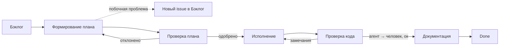

# Рабочий процесс: Star-Audio Backend

> Последнее обновление: 2026-09-09

## 1. Общее описание

Процесс описывает жизненный цикл задачи от постановки в бэклог до фиксации результата в документации проекта. Задачи выполняются агентом (biologic) с обязательным контролем человека на ключевых этапах (проверка плана, проверка кода).

## 2. Статусы задач

| №   | Статус                 | Описание                                                                                                                                                             |
| --- | ---------------------- | -------------------------------------------------------------------------------------------------------------------------------------------------------------------- |
| 1   | **Бэклог**             | Любая задача помещается сюда с простым описанием. Формальных требований к содержимому нет — просто фиксация идеи/проблемы.                                           |
| 2   | **Формирование плана** | Задача поступила в работу и уточняется. Составляется план, опираясь на существующую кодовую базу.                                                                    |
| 3   | **Проверка плана**     | План проверяет **человек**: соответствует ли он паттернам проекта.                                                                                                   |
| 4   | **Исполнение**         | После утверждения плана задача переходит в реализацию.                                                                                                               |
| 5   | **Проверка кода**      | Проверка качества кода. Сначала выполняется **агентом**, затем **человеком**. Условие входа: все тесты CI прошли.                                                    |
| 6   | **Документация**       | После проверки кода принятые решения фиксируются в репозитории: один файл в папку `docs/` по определённому формату. На усмотрение человека — что именно фиксировать. |

## 3. Правила переходов между статусами

### Бэклог → Формирование плана

Задача берётся в работу и уточняется:

- **Обычная task** — уточнение происходит устно/в переписке, без формального документа.
- **Feature / Bug** — требует формального плана: пример(ы) кода, критерии оценки, ожидаемые результаты.
- [Шаблон плана](./templates/plan.template.md)

**Обязательное условие для этапа «Формирование плана»:** использование **агента** для изучения кодовой базы — обязательно. Именно агент пишет примеры кода в плане (человек не пишет код на этом этапе, только направляет и проверяет).
План сохраняется в `docs/plans/`

**Побочные проблемы:** если в процессе изучения кодовой базы агент обнаруживает проблемы, не связанные с текущей задачей, по ним заводится отдельный issue в проекте:

- либо с простым описанием (аналог обычной task в бэклоге),
- либо сразу с планом на исправление (если проблема достаточно ясна, чтобы её оформить как feature/bug).

Работа над текущей задачей при этом не блокируется — побочная проблема уходит отдельным issue в **Бэклог**.

### Формирование плана → Проверка плана

План сформирован (для task — устная договорённость зафиксирована, для feature/bug — оформлен документ с примерами кода, критериями и ожидаемым результатом).

### Проверка плана → Исполнение

Человек проверил план и подтвердил, что он соответствует паттернам, принятым в проекте.

### Проверка плана → Формирование плана (обратный переход)

План не прошёл проверку — возвращается на доработку.

### Исполнение → Проверка кода

Задача реализована, код готов к проверке. **Обязательное условие: все тесты CI прошли.**

### Проверка кода → Документация

Код проверен агентом, затем человеком, замечаний нет.

### Проверка кода → Исполнение (обратный переход)

Найдены проблемы на этапе проверки (агентом или человеком) — задача возвращается на доработку.

### Документация → Done _(предполагаемый финальный статус — уточните, если у вас есть отдельная колонка)_

Файл документации записан в `docs/`, решения зафиксированы — задача считается закрытой.

### Диаграмма

## 4. Различие типов задач

| Тип задачи         | Формирование плана  | Формат плана                                        |
| ------------------ | ------------------- | --------------------------------------------------- |
| **Task** (простая) | Устно / в переписке | Без документа                                       |
| **Feature**        | Формальный          | Примеры кода, критерии оценки, ожидаемые результаты |
| **Bug**            | Формальный          | Примеры кода, критерии оценки, ожидаемые результаты |

## 5. Роли и ответственность

| Роль                 | Обязанности                                                                                                                                                                                             |
| -------------------- | ------------------------------------------------------------------------------------------------------------------------------------------------------------------------------------------------------- |
| **Агент (biologic)** | Обязательно изучает кодовую базу на этапе формирования плана; пишет примеры кода в плане; реализует задачу; выполняет первичную проверку кода; при обнаружении побочных проблем заводит отдельный issue |
| **Человек**          | Направляет и проверяет план на соответствие паттернам проекта; выполняет финальную проверку кода; решает, что фиксировать в документации                                                                |

## 6. Условия перехода (Gate-критерии)

- ✅ **Формирование плана → Проверка плана**: план оформлен по типу задачи (task/feature/bug)
- ✅ **Проверка плана → Исполнение**: план одобрен человеком
- ✅ **Исполнение → Проверка кода**: все тесты CI прошли
- ✅ **Проверка кода → Документация**: код проверен агентом **и** человеком, замечаний нет

## 7. Документация решений

После прохождения проверки кода фиксируется:

- Один файл в папку `docs/adr/`
- Формат файла: [ADR](./templates/adr.template.md)
- Что именно записывать — определяет человек, ведущий задачу

## 8. Инструменты

- Доска задач: [Github](https://github.com/orgs/biologic-app/projects/3)
- Репозиторий: [Biologic](https://github.com/biologic-app/biologic/)
